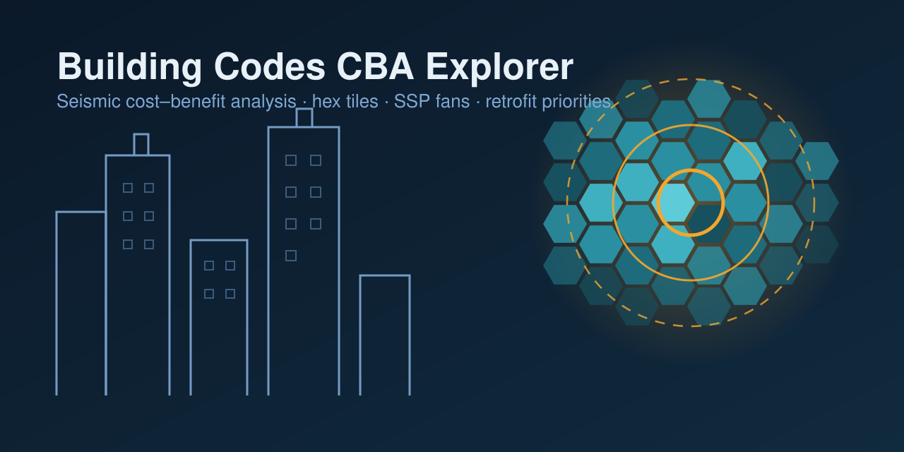
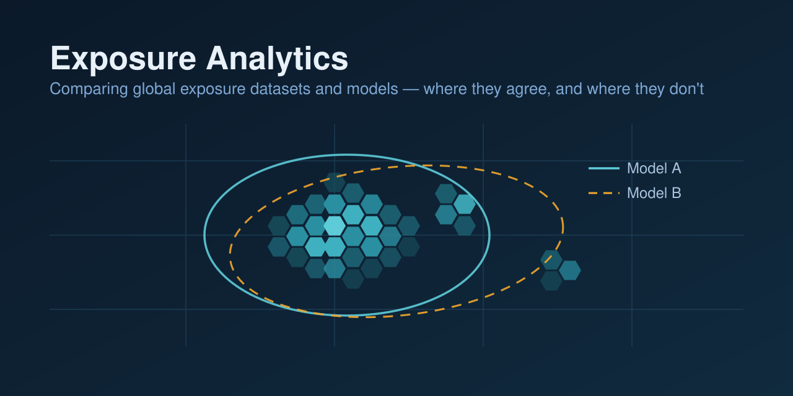
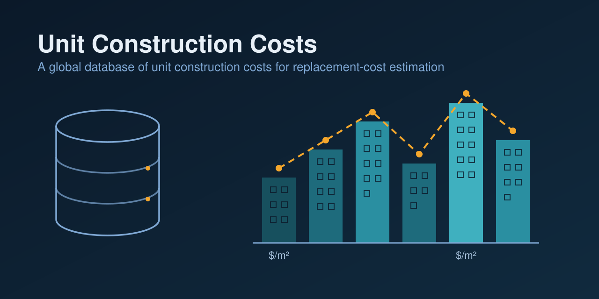
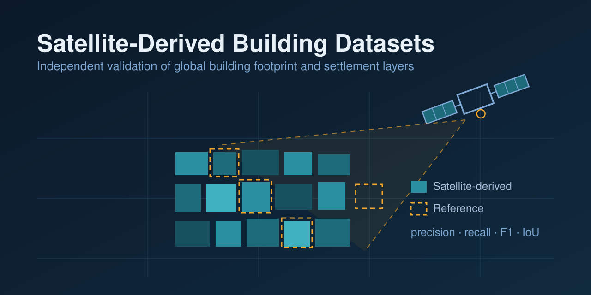

<!-- Uncomment once assets/banner.png is added:

-->

# Hi, I'm Aaron 👋

I work on **disaster risk management** and **resilient infrastructure** — using data and analytics to understand where risk concentrates and how investments in safer buildings and infrastructure pay off.

- 🌍 Based in Washington, DC
- 🏛️ Working with [@worldbank](https://github.com/worldbank) and [@GFDRR](https://github.com/GFDRR)
- 🔎 Focused on disaster risk analytics and the economics of resilience

  
  
  
  
  

## 🗂️ Portfolio

<table>
  <tr>
    <td width="50%">
      
      
<b>🏗️ Building Codes CBA Explorer</b> 
      Interactive explorer for building-code cost-benefit analysis

    </td>
    <td width="50%">
      
      
<b>🛰️ Exposure Analytics</b> 
      A suite of analytics to compare global exposure datasets and models

    </td>
  </tr>
  <tr>
    <td width="50%">
      
      
<b>🧱 Unit Construction Costs</b> 
      Database of unit construction costs (UCC) for replacement-cost estimates

    </td>
    <td width="50%">
      
      
<b>📡 Assessment of Satellite-Derived Building Datasets</b> 
      Independent validation of global building footprint and settlement layers

    </td>
  </tr>
</table>

## 💡 Interests

- Understanding and quantifying disaster risk
- Catastrophe modelling and its applications in development
- Data-driven policy for urban development
- Open data and reproducible analytics

## 🔗 Find me elsewhere

---

Views are my own and do not represent those of my employer.
